# Dank Memes (work-in-progress 👷🔧️👷‍♀️⛏)
[](http://www.apache.org/licenses/LICENSE-2.0)
[](https://circleci.com/gh/tirgei/DankMemes/tree/development)
[](https://www.codacy.com/manual/tirgei/DankMemes?utm_source=github.com&amp;utm_medium=referral&amp;utm_content=tirgei/DankMemes&amp;utm_campaign=Badge_Grade)

This is a social media app for sharing memes (funny pictures). The app is mainly written in Kotlin and uses the Gradle build system. It uses
[Firebase](https://firebase.google.com) for the backend with [Firebase Functions](https://firebase.google.com/docs/functions) providing additional server side functions. You can view the Functions code in the [Dank-Memes-Functions](https://github.com/tirgei/Dank-Memes-Functions) repo with the guide on deploying it.

You can download the app from the Play Store here: [Dank Memes](https://play.google.com/store/apps/details?id=com.gelostech.dankmemes)

### Features
- 100% Kotlin
- MVVM Architecture
- Koin for DI
- Coroutines
- RxJava
- Firebase
    - Firebase Auth
    - Firebase Database
    - Firebase Storage
    - Firebase Firestore
    - Crashlytics
    - Performance Monitoring
    - GCM
- Android Jetpack


### Project setup
To setup the project in your machine

- Clone the repo

```console
foo@bar:~$ git clone https://github.com/tirgei/DankMemes.git
```

You can then import the project to your Android Studio then head to your [Firebase Console](https://console.firebase.google.com/u/0/)

- Create a new **Dank Memes** project.

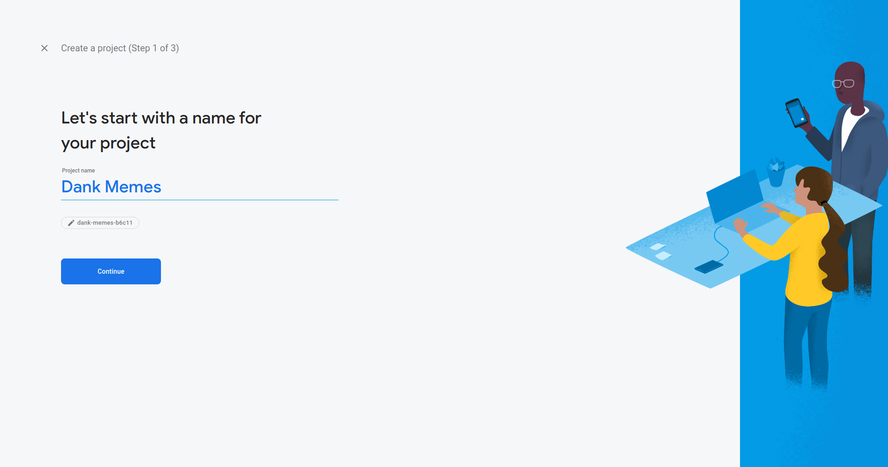

- Enable Email/ Google sign in

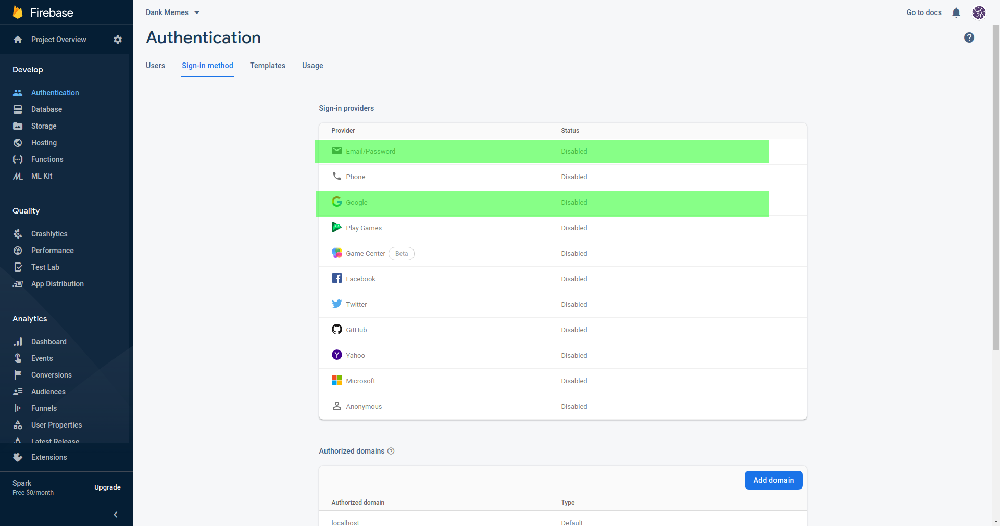

- Add a new Android project under `Project Settings` menu

- Fill in the project details then download the `google-services.json` file and place it in `app/` directory

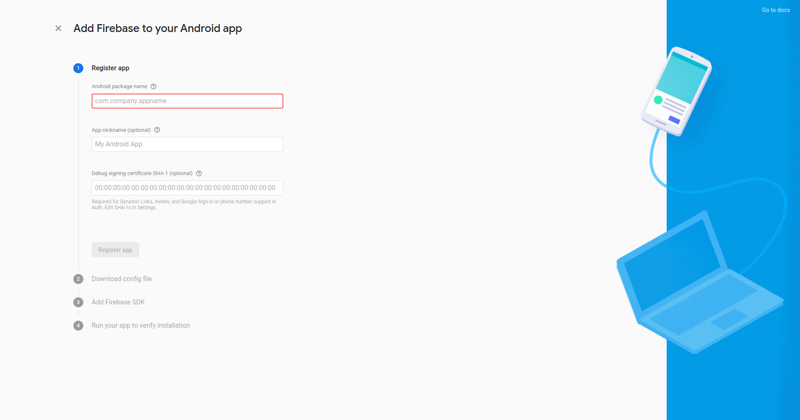

- Create a `keys.xml` file in the `app/src/main/res/values/` directory where we will place our API keys. 
First we'll add the Google Sign In Key to enable users to sign in with Google. This can be obtained from the Authentication page of your Firebase Project. 
Under the Sign-In method tab you should see the `Google` option and on expanding it copy the `Web client ID` under the `Web SDK configuration` option:
```
// Google Sign in key
<string name="google_signin_key">YOUR_GOOGLE_SIGN_IN_KEY</string>
```

For native ads, the following are required (You can use test IDs from the Admob [docs](https://developers.google.com/admob/android/native/advanced))
```
// Admob
<string name="admob_app_id">YOUR_ADMOB_APP_ID</string>
<string name="admob_native_ad_id">YOUR_ADMOB_TEST_AD_ID</string>
```

The Test IDs are:
admob_app_id       - `ca-app-pub-3940256099942544~3347511713`
admob_native_ad_id - `ca-app-pub-3940256099942544/2247696110`

If you are having issues configuring ads or you simply want the ad free version, checkout the `ad-free-version` branch:
```console
foo@bar:~$ git checkout ad-free-version
```

- Sync your gradle. After successful sync, you can run the app to test it out.


### Screenshots

| **Login** | **Registration** | **Home page** |
| ----- | ----- | ----- |
| 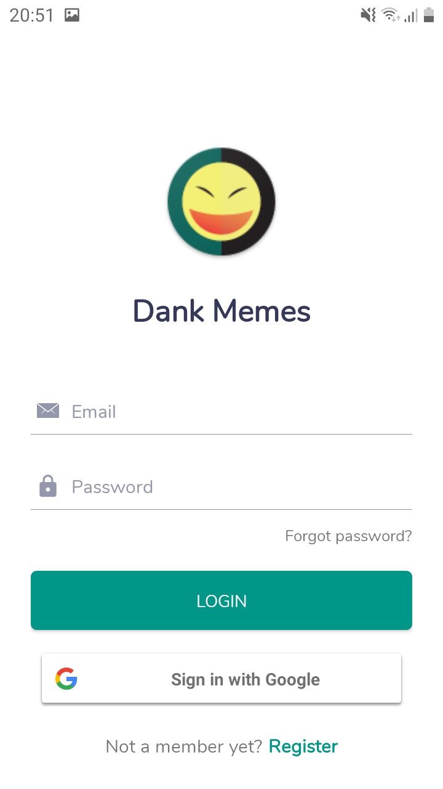 | 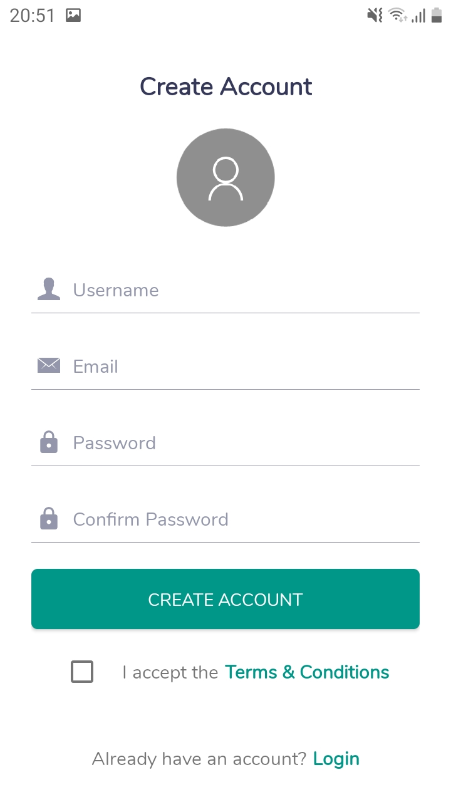 | 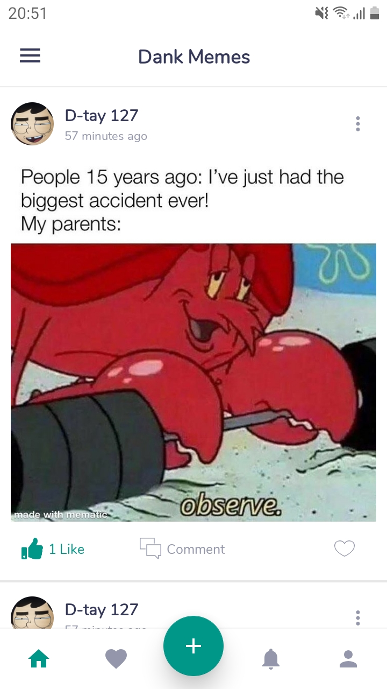 |
| | | |
| **Navigation** | **Favorites** | **Notification** |
| 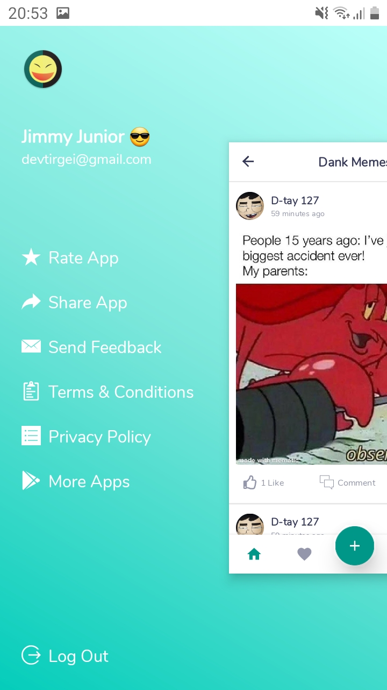 | 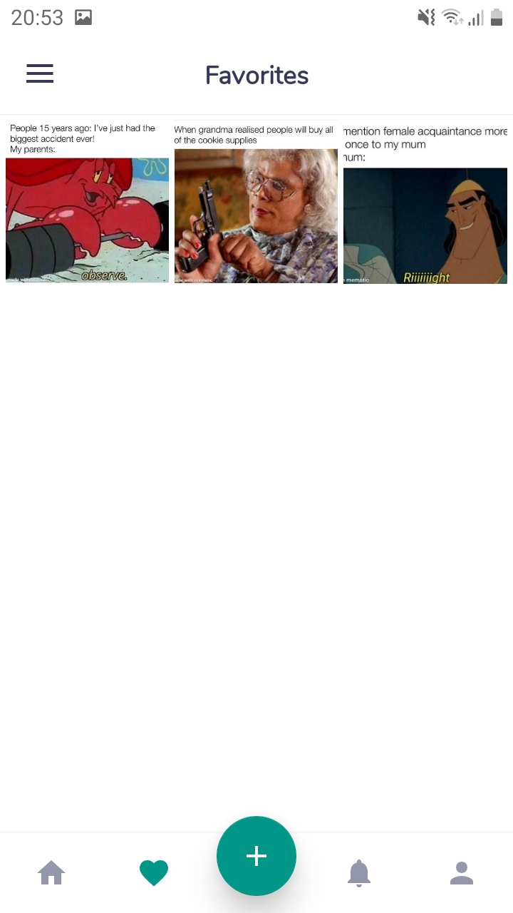 |  |
| | | |
| **My Profile** | **Comments** | **Post Meme** |
| 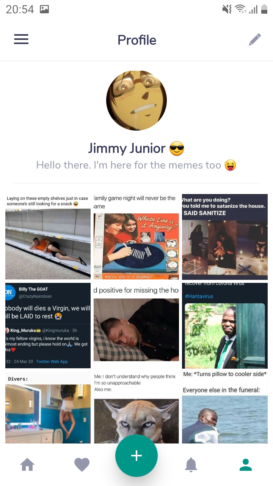 | 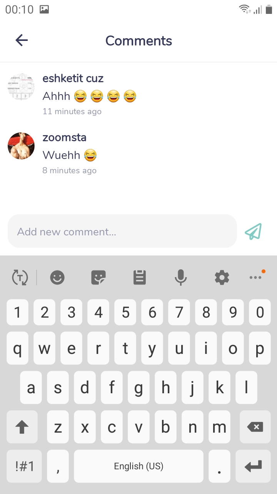 |  |
| | | |
| **Edit Profile** | 
| 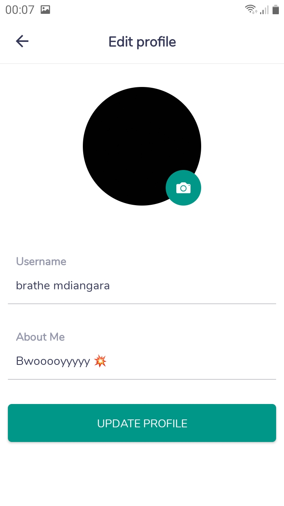 |

### License
```
Copyright 2020 Vincent Tirgei

Licensed under the Apache License, Version 2.0 (the "License");
you may not use this file except in compliance with the License.
You may obtain a copy of the License at

    http://www.apache.org/licenses/LICENSE-2.0

Unless required by applicable law or agreed to in writing, software
distributed under the License is distributed on an "AS IS" BASIS,
WITHOUT WARRANTIES OR CONDITIONS OF ANY KIND, either express or implied.
See the License for the specific language governing permissions and
limitations under the License.
```
